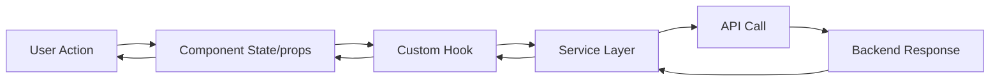
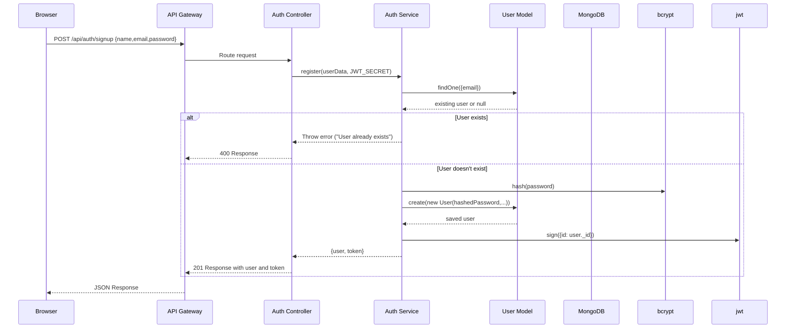
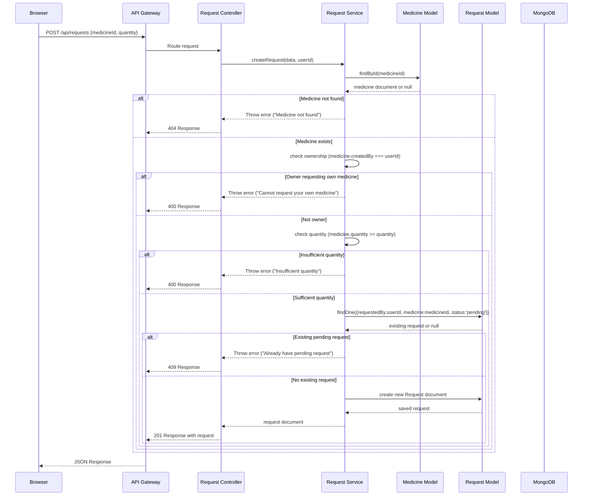

# High Level Design Document: MedDrop Medicine Donation Platform

## 1. Introduction

This document describes the high-level architecture and design decisions for the MedDrop application - a full-stack MERN platform facilitating medicine donation and requests to reduce medical waste.

## 2. System Overview

MedDrop is a web application allowing users to:
- Donate unused medicines with location information
- Request medicines from other users
- Manage medicine requests (accept/reject/cancel)
- View medicine availability on a map interface

The system follows a client-server architecture with a React frontend and Node.js/Express backend connected to a MongoDB database.

## 3. Architectural Goals

1. **Separation of Concerns**: Clear division between presentation, business logic, and data layers
2. **Maintainability**: Modular design enabling easy updates and debugging
3. **Scalability**: Architecture supporting horizontal scaling
4. **Security**: Protection against common web vulnerabilities
5. **Testability**: Design facilitating unit and integration testing
6. **Developer Experience**: Consistent patterns reducing contextual switching

## 4. Architectural Style

The application follows a modified **Model-View-Controller (MVC)** pattern enhanced with **service layer** and **dependency injection** principles:

```
Presentation Layer (React) 
       ↓ (HTTP/JSON)
Application Layer (Express Controllers)
       ↓ 
Business Logic Layer (Services)
       ↓
Data Access Layer (Models)
       ↓
Persistence Layer (MongoDB)
```

## 5. Key Components

### 5.1 Frontend Architecture

#### 5.1.1 Component Hierarchy
```
App
├── Router
│   ├── Public Routes (Login, Signup)
│   └── Protected Routes (Medicines, AddMedicine, etc.)
│       ├── MedicinesPage
│       │   ├── MedicineList
│       │   └── MedicineCard
│       ├── AddMedicinePage
│       │   ├── MedicineForm
│       │   └── GoogleMapPicker
│       ├── EditMedicinePage
│       │   ├── MedicineForm (edit mode)
│       │   └── GoogleMapPicker
│       ├── MapViewPage
│       │   ├── MedicineMap
│       │   └── FilterControls
│       ├── LoginPage
│       │   └── LoginForm
│       └── SignupPage
│           └── SignupForm
```

#### 5.1.2 State Management
- **Local State**: Component-level state for UI interactions (form inputs, toggles)
- **Context API**: Global authentication state (user info, token)
- **Custom Hooks**: Encapsulated logic for data fetching, forms, and maps
- **Service Layer**: Centralized API communication

#### 5.1.3 Data Flow


### 5.2 Backend Architecture

#### 5.2.1 Layered Structure
```
Request Flow:
HTTP Request → Middleware → Controller → Service → Model → Database
                                               ↓
                                          Utils/Helpers
```

#### 5.2.2 Responsibility Separation

| Layer | Responsibility | Examples |
|-------|----------------|----------|
| **Routes** | Define API endpoints, HTTP methods, path parameters | `/api/medicines` (GET, POST) |
| **Controllers** | Handle HTTP concerns: request validation, response formatting, status codes | Validate input, call service, format response |
| **Services** | Contain business logic: validation rules, workflow orchestration, data transformation | Check medicine ownership, validate request quantities |
| **Models** | Data structure definition, database hooks, validation schemas | Mongoose schemas with validation |
| **Middleware** | Cross-cutting concerns: authentication, error handling, logging | JWT verification, async error wrapping |
| **Utils** | Reusable utility functions | Validation helpers, response formatters |

#### 5.2.3 Dependency Direction
Dependencies flow inward: Controllers depend on Services, Services depend on Models, but not vice versa. This follows the Dependency Inversion Principle.

### 5.3 Database Design

#### 5.3.1 Collections

**Users**
```javascript
{
  _id: ObjectId,
  name: String (required),
  email: String (required, unique, lowercase),
  password: String (required, hashed),
  createdAt: Date (default: Date.now)
}
```

**Medicines**
```javascript
{
  _id: ObjectId,
  name: String (required),
  expiryDate: Date (required),
  quantity: Number (required, min: 1),
  notes: String (default: ""),
  location: {
    lat: Number (required),
    lng: Number (required)
  },
  createdBy: ObjectId (ref: User, required),
  createdAt: Date (default: Date.now)
}
```

**Requests**
```javascript
{
  _id: ObjectId,
  requestedBy: ObjectId (ref: User, required),
  requestedTo: ObjectId (ref: User, required),
  medicine: ObjectId (ref: Medicine, required),
  quantity: Number (required, min: 1),
  status: Enum ['pending', 'accepted', 'rejected'] (default: 'pending'),
  createdAt: Date (default: Date.now),
  cancelledByUser: Boolean (default: false)
}
```

#### 5.3.2 Indexes
- Users: email (unique)
- Medicines: createdBy
- Requests: requestedBy, requestedTo, medicine, status
- Compound indexes for common query patterns

## 6. Data Flow Scenarios

### 6.1 User Registration


### 6.2 Creating a Medicine Request


### 6.3 Accepting a Request
```mermaid
sequenceDiagram
    participant Client as Browser
    participant API as API Gateway
    participant ReqCtrl as Request Controller
    participant ReqSvc as Request Service
    participant ReqM as Request Model
    participant MedM as Medicine Model
    participant DB as MongoDB
    
    Client->>API: PATCH /api/requests/:id/respond {status:'accepted'}
    API->>ReqCtrl: Route request
    ReqCtrl->>ReqSvc: respondToRequest(requestId, status, userId)
    ReqSvc->>ReqM: findById(requestId)
    ReqM-->>ReqSvc: request document or null
    alt Request not found
        ReqSvc-->>ReqCtrl: Throw error ("Request not found")
        ReqCtrl-->>API: 404 Response
    else Request exists
        ReqSvc->>ReqSvc: validate status (accepted/rejected)
        alt Invalid status
            ReqSvc-->>ReqCtrl: Throw error ("Invalid status")
            ReqCtrl-->>API: 400 Response
        else Valid status
            ReqSvc->>ReqSvc: check recipient (request.requestedTo === userId)
            alt Not recipient
                ReqSvc-->>ReqCtrl: Throw error ("Not authorized")
                ReqCtrl-->>API: 403 Response
            else Is recipient
                ReqSvc->>ReqSvc: check status (must be pending)
                alt Not pending
                    ReqSvc-->>ReqCtrl: Throw error ("Request already processed")
                    ReqCtrl-->>API: 400 Response
                else Is pending
                    alt Status = accepted
                        ReqSvc->>MedM: findOneAndUpdate(
                                        {_id: request.medicine, quantity: {$gte: request.quantity}},
                                        {$inc: {quantity: -request.quantity}},
                                        {new: true}
                                    )
                        MedM-->>ReqSvc: updated medicine or null
                        alt Medicine not found or insufficient quantity
                            ReqSvc-->>ReqCtrl: Throw error ("Insufficient quantity")
                            ReqCtrl-->>API: 400 Response
                        else Sufficient quantity
                            ReqSvc->>ReqM: update request status to accepted
                            ReqM-->>ReqSvc: updated request
                            ReqSvc->>ReqM: findByIdWithPopulation(requestId)
                            ReqM-->>ReqSvc: populated request
                            ReqSvc-->>ReqCtrl: populated request
                            ReqCtrl-->>API: 200 Response with request
                        end
                    else Status = rejected
                        ReqSvc->>ReqM: update request status to rejected
                        ReqM-->>ReqSvc: updated request
                        ReqSvc->>ReqM: findByIdWithPopulation(requestId)
                        ReqM-->>ReqSvc: populated request
                        ReqSvc-->>ReqCtrl: populated request
                        ReqCtrl-->>API: 200 Response with request
                    end
                end
            end
        end
    end
    API-->>Client: JSON Response
```

## 7. Security Considerations

### 7.1 Authentication & Authorization
- **JWT Tokens**: Secure stateless authentication with HTTP-only cookies consideration for future enhancement
- **Password Hashing**: bcrypt with salt rounds (10)
- **Route Protection**: Middleware verifying token validity and attaching user to request
- **Resource Ownership Checks**: All modification endpoints verify user owns the resource

### 7.2 Input Validation & Sanitization
- **Server-side Validation**: All endpoints validate input despite client-side validation
- **Parameter Sanitization**: MongoDB operator injection prevention
- **XSS Prevention**: React auto-escaping, careful with dangerouslySetInnerHTML usage
- **CSRF Protection**: SameSite cookies and token-based protection planned for future

### 7.3 Data Protection
- **Environment Variables**: Secrets never committed to repository
- **Database Connection**: MongoDB connection string secured
- **Error Handling**: Generic error messages in production to avoid information leakage

## 8. Performance Considerations

### 8.1 Database Optimization
- **Indexing**: Strategic indexes on queried fields
- **Projection**: Only fetching necessary fields in queries
- **Aggregation Pipelines**: For complex queries (future enhancement)
- **Connection Pooling**: MongoDB native driver pooling

### 8.2 Network Efficiency
- **API Response Shaping**: Only sending necessary data
- **Pagination**: Implement for large datasets (future)
- **Caching**: Client-side caching with react-query or SWR (future)
- **Compression**: gzip/deflate for API responses

### 8.3 Frontend Performance
- **Code Splitting**: Route-based lazy loading
- **Memoization**: useCallback and useMemo for expensive computations
- **Virtualization**: For large lists (future)
- **Asset Optimization**: Image compression, SVG icons

## 9. Error Handling & Logging

### 9.1 Backend Error Handling
- **Centralized Error Handler**: Express error-middleware catches async errors
- **Error Classification**: 
  - Operational errors (validation, business rules) → 4xx responses
  - Programmatic errors (database failures) → 500 responses
- **Logging**: Structured logging with winston or pino (planned enhancement)

### 9.2 Frontend Error Handling
- **Error Boundaries**: Catch UI errors in component tree
- **Service Interceptors**: Standardize error responses from API
- **User Feedback**: Toast notifications for success/error states
- **Retry Mechanisms**: Exponential backoff for failed requests (planned)

## 10. Deployment Considerations

### 10.1 Environment Separation
- **Development**: Local MongoDB, hot reloading
- **Staging**: Mirror of production with sanitized data
- **Production**: Managed MongoDB Atlas, Node.js cluster, Nginx reverse proxy

### 10.2 Scaling Strategies
- **Horizontal Scaling**: Stateless Node.js instances behind load balancer
- **Database Sharding**: By user ID or geographic region (future)
- **Caching Layer**: Redis for session storage and frequent queries
- **CDN**: Static asset delivery via Cloudflare or AWS CloudFront

### 10.3 Monitoring & Observability
- **Health Checks**: Endpoint for load balancer health checks
- **Metrics**: Request latency, error rates, throughput (Prometheus/Grafana)
- **Logging**: Centralized logging (ELK stack or similar)
- **Error Tracking**: Sentry or similar for frontend and backend errors

## 11. Trade-offs & Decisions

### 11.1 Chosen Technologies
- **MongoDB** over SQL: Flexible schema for evolving medicine attributes, geographic queries
- **Express** over other Node.js frameworks: Minimalist, mature ecosystem, middleware system
- **React** over Vue/Angular: Team familiarity, extensive ecosystem, virtual DOM performance
- **Tailwind CSS** over CSS-in-JS: Utility-first approach, smaller bundle sizes, design consistency

### 11.2 Architectural Trade-offs
- **Service Layer Abstraction**: 
  - *Pros*: Separation of concerns, testability, reusability
  - *Cons*: Slightly more indirection, initial learning curve
- **Custom Hooks in Frontend**:
  - *Pros*: Logic reuse, separation of concerns, testability
  - *Cons*: Potential over-abstraction for simple cases
- **Centralized API Service**:
  - *Pros*: Consistent configuration, automatic auth handling, error interception
  - *Cons*: Additional layer, potential over-engineering for simple apps

## 12. Future Evolution Path

### 12.1 Short-term (0-3 months)
- Implement comprehensive unit and integration tests
- Add request cancellation and restocking endpoints (already completed in refactor)
- Enhance error logging and monitoring
- Implement pagination for medicine lists

### 12.2 Medium-term (3-6 months)
- Add medicine expiration notifications via email/push
- Implement medicine categorization and search/filtering
- Add user profiles with donation history and ratings
- Introduce role-based access (admin/moderator roles)

### 12.3 Long-term (6+ months)
- Mobile application (React Native)
- Advanced geolocation features (proximity-based medicine discovery)
- Integration with pharmacy systems for expired medicine disposal
- Machine learning for demand prediction and supply optimization

## 13. Conclusion

The MedDrop application implements a robust, maintainable architecture that separates concerns while remaining pragmatic. The refactored service-layer approach provides clear boundaries between concerns, facilitating team collaboration and long-term maintenance. The foundation laid allows for straightforward extension of features while maintaining code quality and consistency.

The system is designed to evolve with changing requirements while preserving its core principles of security, performance, and developer experience.